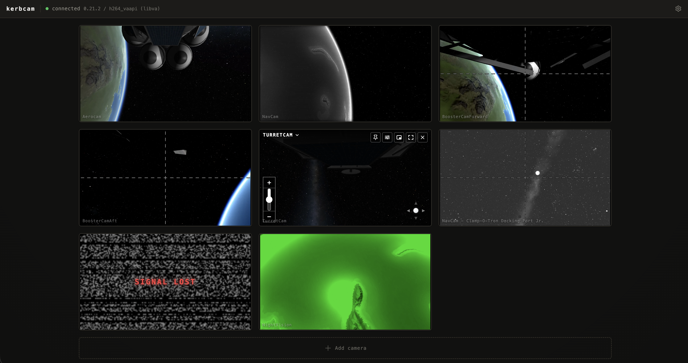

# kerbcast

A from-scratch, high-performance oriented successor to OCISLY for streaming Kerbal Space Program camera feeds to a browser. Hardware-accelerated H.264 over WebRTC, with full Hullcam VDS camera-type fidelity. Designed with Linux in mind, Windows and MacOS support is a little experimental.

  

## What it does

- Streams HullcamVDS camera sources to a browser via the bundled kerbcast web UI or through [@ksp-gonogo/kerbcast](https://www.npmjs.com/package/@ksp-gonogo/kerbcast), a TypeScript SDK
- Supports performance tweak options to keep fps reasonable through degrading resolution, framerate, and shedding render layers. By default, performance should feel vastly improved over the original OCISLY mod
- Introduces optional shaders for wind and re-entry FX
- Supports popular visual mods so their effects show on the camera feeds: Scatterer, EVE, TUFX, Deferred, Firefly, and Parallax
- Streams each crew member's face as a live camera, seated in the cabin and out on EVA, shown together in a dedicated crew bar
- Can point a pannable, zoomable camera at the active vessel or its target and have it follow automatically, aiming and zooming to keep it framed
- HullcamVDS implementation enhancements:
  - Honours each camera's `cameraMode` so B&W / CRT / night-vision variants look like they do in the in-game Hullcam GUI
  - Introduces planned but never fully implemented panning options for turret cam and launch cam
  - Supports a data channel for sending control data from clients (eg pan/zoom)
  - Fixes and patches long term issues on Linux

### How it does it

- Captures KSP Hullcam VDS camera feeds inside the game via `AsyncGPUReadback`, with zero stall on the game's main thread
- Encodes them in an out-of-process 'sidecar': software H.264 (OpenH264) as the fallback, with hardware H.264 on Linux / Steam Deck (libva), and NVENC (Windows). VideoToolbox (macOS) is stubbed pending implementation
- Streams them out as WebRTC media tracks, with adaptive bitrate, congestion control, and packet loss recovery for free
- Renders cameras only when a peer is subscribed, so no idle CPU work and no in-game UI required

## Status: Initial Release - expect bugs

Kerbcast is just becoming ready for general consumption. It supports Linux, with limited testing on Windows and MacOS.

Issues and PRs are welcome, particularly if you'd like to 'adopt' macOS or Windows support.

## Install

Easiest is **CKAN**. Otherwise grab the latest `kerbcast-*.zip` from the [releases page](https://github.com/ksp-gonogo/kerbcast/releases) (or the [SpaceDock listing](https://spacedock.info/mod/4366/Kerbcast)) and follow the install steps in that release's notes. For a manual install, ensure you also install [Hullcam VDS Continued](https://github.com/linuxgurugamer/HullcamVDSContinued) and [Harmony 2](https://github.com/KSPModdingLibs/HarmonyKSP).

For the longer version with multi-device setup, configuration, info on what's in the bundle, see [docs/INSTALL.md](docs/INSTALL.md). If something doesn't work, [docs/TROUBLESHOOTING.md](docs/TROUBLESHOOTING.md) walks the common failures.

## Differences to OCISLY

OCISLY uses `ReadPixels` + `EncodeToJPG` on the game's main thread and ships JPEG over unary gRPC at 30 Hz. That works, but it costs real frame budget, particularly on lower powered devices, and doesn't support the visual character that Hullcam VDS encodes per part. Kerbcast aims to fix both while prioritising high performance through hardware encoding and modern Unity API use.

### Performance

This mod was built initally for getting best performance out of Steam Deck, and it does a good job of it. Regardless of the number of camera renders streaming, Kerbcast can adjust quality and framerate to ensure KSP FPS stays within the ideal range for in-game physics. It also uses a time budget to ensure it doesn't balloon render time. Each stream is SD by default, but can be increased. Render quality will always be able to reduce to ensure streaming continues.

## Toolchain

- Plugin: C# / .NET Framework 4.8, against KSP's Unity 2019.4 LTS assemblies
- Sidecar: Rust (stable), out-of-process H.264 encoder and WebRTC signalling
- Protocol: Rust types in `sidecar/src/protocol/`, TypeScript SDK at `client-sdk/typescript/`

## kOS addon (optional)

**KerbcastKos** lets a [kOS](https://github.com/KSP-KOS/KOS) script running on a vessel enumerate that vessel's kerbcast cameras and control them from kerboscript: set field of view, pan steerable mounts, target-track a moving point (`SET cam:AIM TO { RETURN TARGET:POSITION. }.`), and auto-track the active vessel or its target on a pannable, zoomable camera (`SET cam:TRACK TO "target".`). Auto-track is shared with the browser: a mode set from kerboscript shows up in every viewer, and a viewer-set mode reads back in kerboscript. It ships as a separate optional download (`KerbcastKos-*.zip` on the [releases page](https://github.com/ksp-gonogo/kerbcast/releases)) and needs both kerbcast and kOS installed.

Full API and examples: [GameData/KerbcastKos/README.md](GameData/KerbcastKos/README.md).

## Companion project

[gonogo](https://github.com/ksp-gonogo/gonogo) - a WIP mission-control browser SPA that consumes kerbcast feeds (and a few other things).

